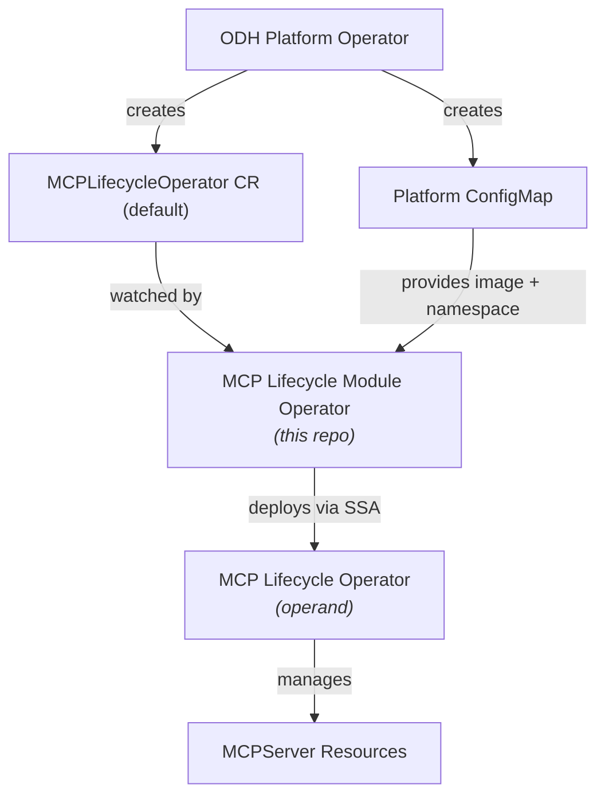
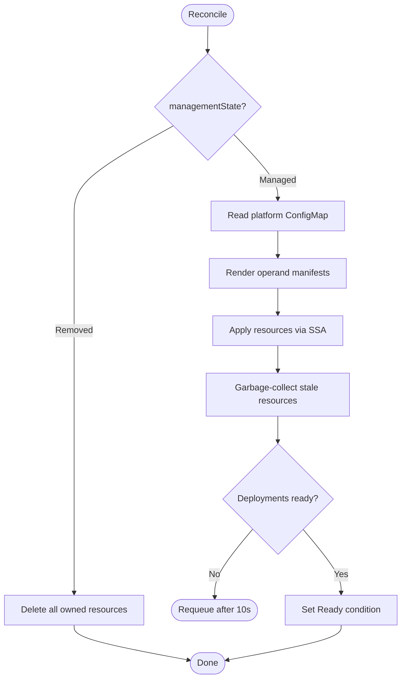

# MCP Lifecycle Module Operator

A Kubernetes operator that manages the lifecycle of the [MCP Lifecycle Operator](https://github.com/opendatahub-io/mcp-lifecycle-operator) as a module within [Open Data Hub](https://opendatahub.io/) (ODH).

This operator follows the [ODH modular architecture](https://docs.google.com/document/d/1FgN_U-6XH8M-Mu6XNeldUlTPsnw7UyPCWg5NVJJdYnw) pattern: the ODH platform operator creates a `MCPLifecycleOperator` custom resource, and this module operator reconciles it by deploying and managing the MCP Lifecycle Operator operand.

## Architecture



**Key concepts:**

- **Module operator** (this repo) - manages the lifecycle of the operand; deployed by the ODH platform.
- **Operand** - the MCP Lifecycle Operator itself, deployed by this module operator.
- **Platform ConfigMap** (`opendatahub-mcplifecycleoperator-config`) - delivers the operand image reference and target namespace from the platform. See [v2 of the Onboarding Guide](https://docs.google.com/document/d/1FgN_U-6XH8M-Mu6XNeldUlTPsnw7UyPCWg5NVJJdYnw) for details on this pattern.

## Reconciliation Flow



## Prerequisites

- Kubernetes / OpenShift cluster
- `kubectl` configured for your cluster
- The module operator image (or build it yourself - see [CONTRIBUTING.md](CONTRIBUTING.md))

## Installation

### Deploy to a cluster

```bash
# Deploy the operator (uses quay.io/opendatahub/mcp-lifecycle-module-operator:latest by default)
make deploy

# Or specify a custom image
make deploy IMG=quay.io/myrepo/mcp-lifecycle-module-operator:v0.1.0
```

### Create the platform ConfigMap

The platform ConfigMap tells the module operator which operand image to deploy and where:

```yaml
apiVersion: v1
kind: ConfigMap
metadata:
  name: opendatahub-mcplifecycleoperator-config
  namespace: mcp-lifecycle-module-operator-system
data:
  operand-image: "quay.io/redhat-user-workloads/mcp-lifecycle-operator-tenant/mcp-lifecycle-operator-main@sha256:..."
  operand-namespace: "mcp-lifecycle-operator-system"
```

A sample is provided at `config/samples/platform-config.yaml`.

> In a full ODH deployment, this ConfigMap is created and managed by the platform operator automatically.

### Create the MCPLifecycleOperator CR

```yaml
apiVersion: components.platform.opendatahub.io/v1alpha1
kind: MCPLifecycleOperator
metadata:
  name: default
spec:
  managementState: Managed
```

A sample is provided at `config/samples/mcplifecycleoperator.yaml`.

The CR is cluster-scoped and its name must be `default` (enforced by validation). Set `managementState` to `Removed` to tear down the operand.

### Uninstall

```bash
make undeploy
```

## Custom Resource Reference

| Field | Description |
|---|---|
| `spec.managementState` | `Managed` (deploy/reconcile the operand) or `Removed` (delete all operand resources) |
| `status.phase` | `Ready` or `NotReady` |
| `status.conditions` | Standard conditions: `Ready`, `ProvisioningSucceeded`, `Degraded`, `MCPLifecycleOperatorAvailable` |
| `status.releases` | Reports the module operator version and repo URL |

## Related Resources

- [Onboarding Guide for ODH Operator Modules](https://docs.google.com/document/d/1FgN_U-6XH8M-Mu6XNeldUlTPsnw7UyPCWg5NVJJdYnw) - the guide followed to implement this module operator
- [ODH Operator Evolution](https://docs.google.com/document/d/1EqY8gf-YyVM5V9DbmD_lCThUJ19BNBWyTgJT9stdzzw) - vision document for the modular architecture
- [Modular Architecture Handler Analysis](https://docs.google.com/document/d/1X-9FFRwUI8mEknbzr7JxYTv-4Bm19Owp0zsdugMqCik) - technical analysis of the ModuleHandler interface
- [opendatahub-io/mcp-lifecycle-operator](https://github.com/opendatahub-io/mcp-lifecycle-operator) - the operand managed by this module operator
- [opendatahub-io/odh-platform-utilities](https://github.com/opendatahub-io/odh-platform-utilities) - shared utilities library used by module operators

## Contributing

See [CONTRIBUTING.md](CONTRIBUTING.md) for development setup, building, testing, and project structure.
